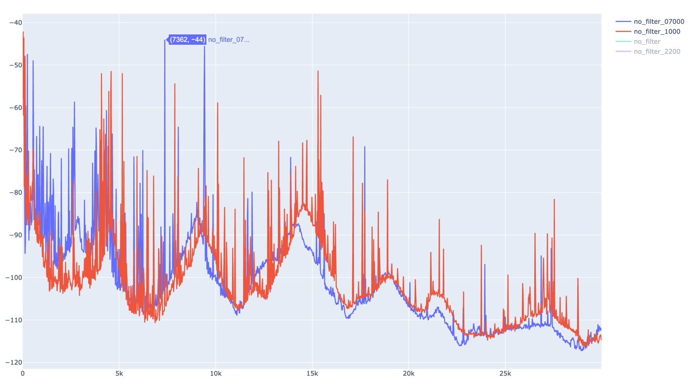

***What it does***

1. **record.py** receive power level from one or more Kiwis to multiple .csv files **OR** sweep over a defined freq range
2. **plotcsv.py** plot a simple graph from the recorded .csv to show received power vs time / received power vs frequency

***Requirements***  
pip3 install pandas plotly
...maybe some more

You need to have kiwirecorder.py in the same directory (a symbolic link works fine!)
  
***Usage***
Edit a kiwiplot-source.csv from the example file.  
**Syntax:** [Frequency (Hz)],[Kiwi URL],[Kiwi port]  

**Example** to measure single frequencies over time:  
9000,dg7lan.kiwi.com,8073  
147.3,dg7lan.kiwi.com,8073  

For sweep measurements only the first entry line is used.  

**Example** for single frequency measurements:  
record.py (record.py [-u username])  
This takes all entries from the csv and measures periodically

When finished, press CTRL-C to stop then use   plotcsv.py -i filename.csv

**Example** to sweep over a frequency range (2kHz to 30MHz) with a bandwidth of 5kHz, averaging over 2 s-meter samples and the name "no_filter_1000":  
record.py -u dg7lan_measure -w 5000 -i 20 -s 2 -b 2 -t 30000 -n no_filter_1000

The result is a csv file that can be plotted with plotcsv.py:  

The csv can hold multiple measurements that will be overlayed and can be turned on or off in the browser.  

usage: record.py [-h] [-u USER] [-w BW] [-i INCREMENT] [-b BOTTOM] [-t TOP] [-s SSAMPLES] [-n NAME]  
| Switch | Command | Description |
| --- | --- | --- |
| -h | --help | show this help message and exit |  
| -u USER | --user USER | username / callsign |  
| -w BW | --bw BW | bw in Hz |
| -i INCREMENT | --increment INCREMENT | if set, will go through a range in [increment] steps (Hz), ignoring the frequency set in the config file |  
| -b BOTTOM | --bottom BOTTOM | if -b is set this will be the first frequency (kHz) to measure |
| -t TOP | --top TOP | if -t is set this will be the last frequency (kHz) to measure |  
| -s SSAMPLES | --ssamples SSAMPLES |smeter samples |
| -n NAME | --name NAME | name of measurement (identifier) |
| -d SECONDS | --delay SECONDS  |  wait n seconds between measurements (usually set to 0 for sweep mode) |

